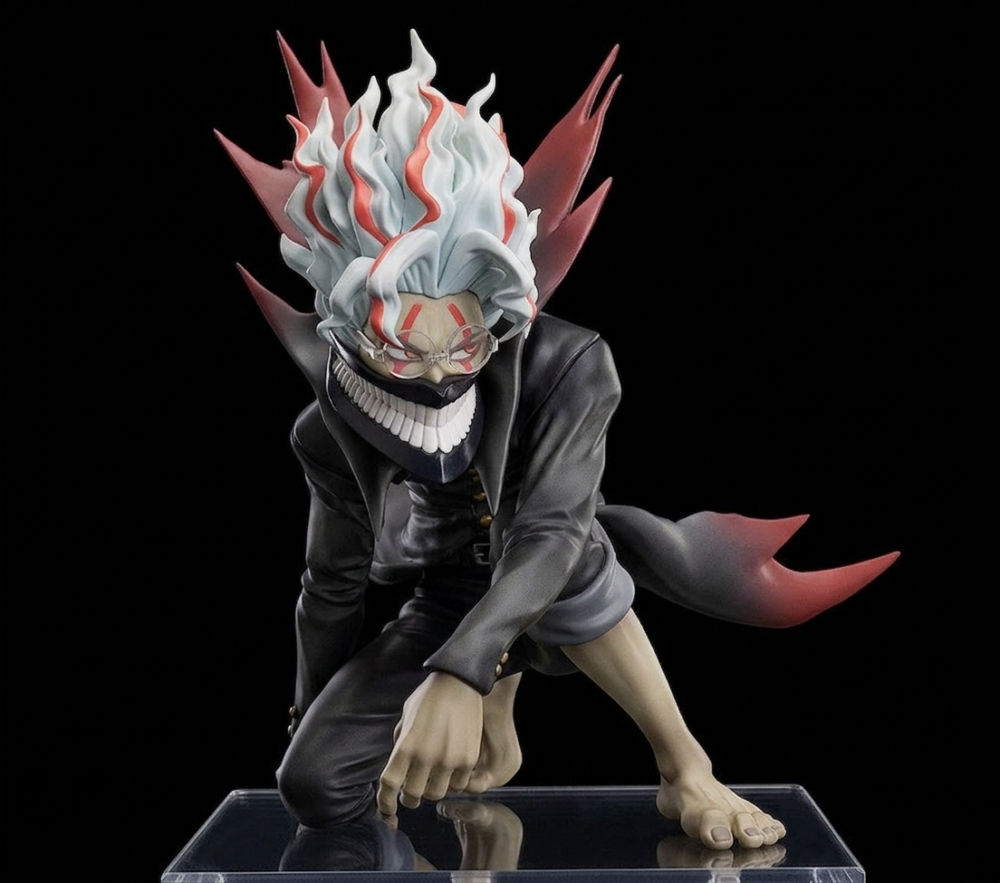
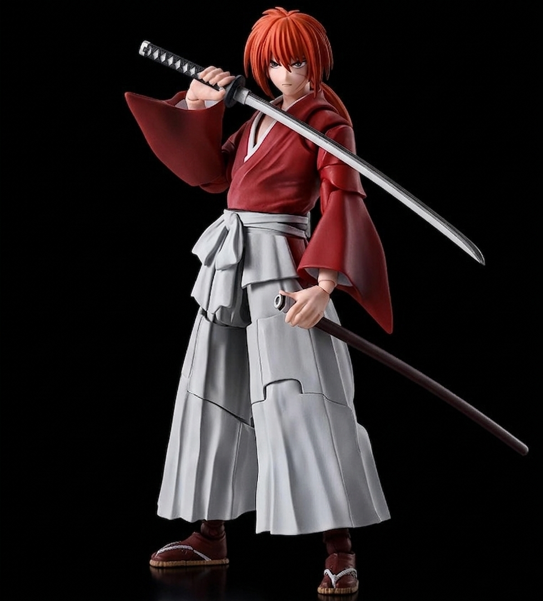
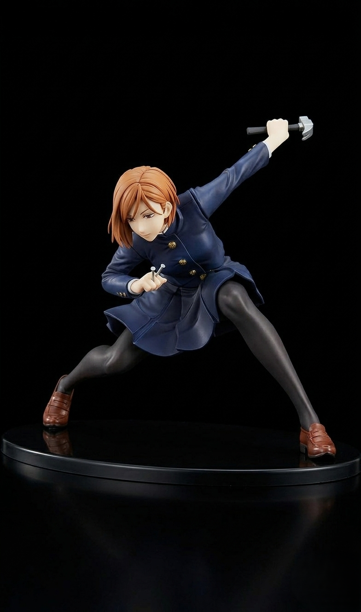
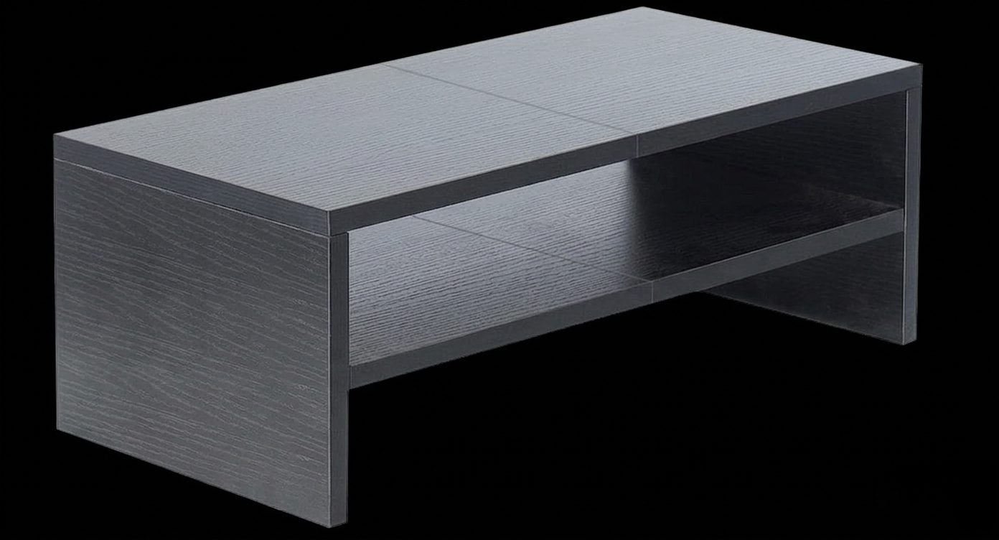
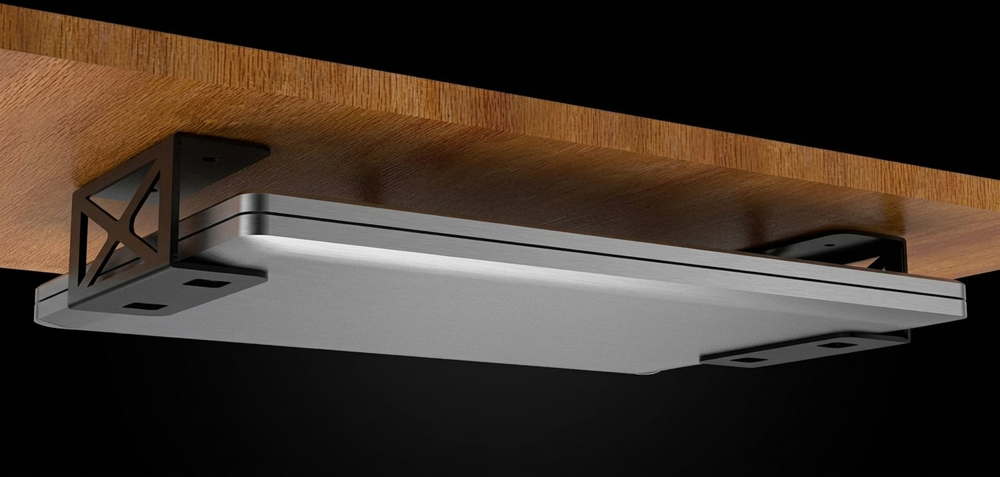

<!DOCTYPE html>
<html lang="es">
<head>
<meta charset="UTF-8">
<meta name="viewport" content="width=device-width, initial-scale=1.0">
<title>EDEX 3D — Figuras Artesanales</title>
<link rel="preconnect" href="https://fonts.googleapis.com">
<link rel="preconnect" href="https://fonts.gstatic.com" crossorigin>
<link href="https://fonts.googleapis.com/css2?family=Cormorant+Garamond:ital,wght@0,300;0,400;0,600;1,300;1,400&family=Space+Mono:wght@400;700&family=Bebas+Neue&display=swap" rel="stylesheet">

</head>
<body>

<!-- CUSTOM CURSOR -->

<!-- WEBGL BACKGROUND -->
<canvas id="webgl-bg"></canvas>

<!-- NOTIFICATION -->

  🛒
  Producto añadido al carrito

<!-- NAV -->
<nav>
  <a href="#" class="nav-logo">EDEX.3D</a>
  

    <a href="#productos">Colección</a>
    <a href="#proceso">Proceso</a>
    <a href="#galeria">Galería</a>
    <a href="#tienda">Tienda</a>
  

  <button class="nav-cart" onclick="openModal()">
    CARRITO
    0
  </button>
</nav>

<!-- HERO -->
<section id="hero">
  
Artesanía Digital · Resina UV · Impresión 3D

  

  
Figuras artesanales creadas con tecnología de impresión 3D en resina fotopolimérica

  

    <a href="#productos" class="btn-primary">Ver Colección</a>
    <a href="#proceso" class="btn-secondary">Ver Proceso</a>
  

  

    

    SCROLL
  

</section>

<!-- MARQUEE -->

  

    RESINA UV◆
    IMPRESIÓN 3D◆
    FIGURAS ARTESANALES◆
    ALTA DEFINICIÓN◆
    PINTADO A MANO◆
    EDICIÓN LIMITADA◆
    RESINA UV◆
    IMPRESIÓN 3D◆
    FIGURAS ARTESANALES◆
    ALTA DEFINICIÓN◆
    PINTADO A MANO◆
    EDICIÓN LIMITADA◆
  

<!-- PRODUCTS -->
<section id="productos">
  

    

      
Colección Principal

      <h2 class="section-title">FIGURAS DESTACADAS</h2>
    

    <a href="#tienda" class="section-link">Ver todas →</a>
  

  

      <!-- PRODUCTO: Dragón Ancestral — imágenes: frente y reverso de la figura -->
      

          
          

              
Edición Limitada · 12/50

              
Dragón Ancestral

              
RD$2,800

              

                  <button class="btn-add">+ Añadir</button>
              

          

      

      

          
          

              
Best Seller

              
Samurái del Viento

              
RD$1,900

              
<button class="btn-add">+ Añadir</button>

          

      

      

          
          

              
Nuevo

              
Kitsune Celestial

              
RD$2,200

              
<button class="btn-add">+ Añadir</button>

          

      

      

          
          

              
Popular

              
Guerrera de Cristal

              
RD$1,600

              
<button class="btn-add">+ Añadir</button>

          

      

      

          
          

              
Premium · Ed. Especial

              
Lobo Lunar

              
RD$3,100

              
<button class="btn-add">+ Añadir</button>

          

      

  

</section>

    <!--prueba de agregar una nueva seccion===========================================-->

<section id="productos">
    

        

            
Colección Principal

            <h2 class="section-title">MODELOS RECIENTES</h2>
        

        <a href="#tienda" class="section-link">Ver todas →</a>
    

    

        <!-- PRODUCTO: Dragón Ancestral — imágenes: frente y reverso de la figura -->
        

            
            

                
Edición Limitada · 12/50

                
Dragón Ancestral

                
RD$2,800

                

                    <button class="btn-add">+ Añadir</button>
                

            

        

        

            
            

                
Best Seller

                
Samurái del Viento

                
RD$1,900

                
<button class="btn-add">+ Añadir</button>

            

        

        

            
            

                
Nuevo

                
Kitsune Celestial

                
RD$2,200

                
<button class="btn-add">+ Añadir</button>

            

        

        

            
            

                
Popular

                
Guerrera de Cristal

                
RD$1,600

                
<button class="btn-add">+ Añadir</button>

            

        

        

            
            

                
Premium · Ed. Especial

                
Lobo Lunar

                
RD$3,100

                
<button class="btn-add">+ Añadir</button>

            

        

    

</section>

<!--=======prueba fin===============-->

<!-- PROCESS -->
<section id="proceso">
  

    
Nuestro Proceso

    <h2 class="section-title">ARTE EN RESINA</h2>
    

      Cada figura nace de un proceso meticuloso de diseño digital y fabricación artesanal. Usamos resina fotopolimérica de alta calidad curada con luz UV, logrando detalles imposibles con métodos tradicionales.
    

    

      

        
01

        

          <h4>Diseño 3D</h4>
          
Modelado digital en ZBrush y Blender con detalle micrométrico.

        

      

      

        
02

        

          <h4>Impresión en Resina</h4>
          
Impresora de resina MSLA con resolución 8K para capturar cada detalle.

        

      

      

        
03

        

          <h4>Curado UV</h4>
          
Curado con cámara UV de 405nm para máxima dureza y detalle.

        

      

      

        
04

        

          <h4>Pintura a Mano</h4>
          
Aplicación manual de capas con aerógrafo y pincel de precisión.

        

      

    

    <a href="#galeria" class="btn-secondary">Ver Galería del Proceso →</a>
  

  <video class="video-frame" autoplay muted loop playsinline>
      <source src="impresora.mp4" type="video/mp4">
</section>

<!-- GALLERY -->
<section id="galeria">
  

    
Galería

    <h2 class="section-title">PROCESO & DETALLE</h2>
  

  

    

      

🖨️

      

🎨

      

💎

      

🔬

      

✨

      

🐉

      

⚔️

      

🦊

      <!-- Duplicado para loop -->
      

🖨️

      

🎨

      

💎

      

🔬

      

✨

      

🐉

      

⚔️

      

🦊

    

  

</section>

<!-- TESTIMONIALS -->
<section id="testimonios">
  

    
Reseñas

    <h2 class="section-title">LO QUE DICEN</h2>
  

  

    

      
★★★★★

      
El detalle del Dragón Ancestral es absolutamente impresionante. Cada escama perfectamente definida. Una obra de arte que decora mi colección.

      
— Carlos M., Santo Domingo

    

    

      
★★★★★

      
Llegó en perfectas condiciones, empaque protector y presentación de lujo. El Kitsune supera todas las expectativas, los colores son vibrantes y duraderos.

      
— María L., Santiago

    

    

      
★★★★★

      
Increíble calidad de resina. He comprado en otras tiendas y ninguna tiene este nivel de precisión. EDEX 3D es mi única opción de ahora en adelante.

      
— Javier R., San Pedro

    

  

</section>

<!-- SHOP / CHECKOUT -->
<section id="tienda">
  

    
Tienda

    <h2 class="section-title">COMPRA AHORA</h2>
  

  

    

      

        

            <!--modificacion de imagen-->
            
          

            
Dragón Ancestral

            
SKU-001 · 18cm · Resina UV Premium

          

          

            <button class="qty-btn" onclick="changeQty('dragon', -1)">−</button>
            1
            <button class="qty-btn" onclick="changeQty('dragon', 1)">+</button>
          

          
RD$2,800

        

        

          
⚔️

          

            
Samurái del Viento

            
SKU-002 · 15cm · Resina UV Premium

          

          

            <button class="qty-btn" onclick="changeQty('samurai', -1)">−</button>
            0
            <button class="qty-btn" onclick="changeQty('samurai', 1)">+</button>
          

          
RD$0

        

        

          
🦊

          

            
Kitsune Celestial

            
SKU-003 · 14cm · Resina UV Premium

          

          

            <button class="qty-btn" onclick="changeQty('kitsune', -1)">−</button>
            0
            <button class="qty-btn" onclick="changeQty('kitsune', 1)">+</button>
          

          
RD$0

        

        

          
🐺

          

            
Lobo Lunar

            
SKU-004 · 22cm · Edición Especial

          

          

            <button class="qty-btn" onclick="changeQty('lobo', -1)">−</button>
            0
            <button class="qty-btn" onclick="changeQty('lobo', 1)">+</button>
          

          
RD$0

        

      

    

    <!-- ORDER SUMMARY -->
    

      
RESUMEN

      

        Subtotal
        RD$2,800
      

      

        
Envío

        

          

            

            

              
Estándar Nacional

              
5-7 días hábiles

            

          

          
RD$200

        

        

          

            

            

              
Express

              
2-3 días hábiles

            

          

          
RD$450

        

        

          

            

            

              
Recoger en tienda

              
Santo Domingo · Hoy

            

          

          
GRATIS

        

      

      

        Envío
        RD$200
      

      

        ITBIS (18%)
        RD$504
      

      

        TOTAL
        RD$3,504
      

      

        <label class="form-label">Nombre completo</label>
        <input type="text" class="form-input" placeholder="Juan Pérez" id="customer-name">
      

      

        <label class="form-label">Email</label>
        <input type="email" class="form-input" placeholder="tu@email.com" id="customer-email">
      

      

        <label class="form-label">Dirección de envío</label>
        <input type="text" class="form-input" placeholder="Calle, No., Ciudad" id="customer-address">
      

      <button class="btn-checkout" onclick="openModal()">
        PROCEDER AL PAGO →
      </button>
      
🔒 Pago seguro 256-bit SSL encriptado

    

  

</section>

<!-- FOOTER -->
<footer>
  

    

      <a href="#" class="nav-logo">EDEX.3D</a>
      
Figuras artesanales creadas con pasión, tecnología de vanguardia y resina fotopolimérica de máxima calidad. República Dominicana.

    

    

      <h5>Tienda</h5>
      

        <a href="#productos">Colección</a>
        <a href="#tienda">Comprar</a>
        <a href="#">Personalizar</a>
        <a href="#">Ediciones Limitadas</a>
      

    

    

      <h5>Info</h5>
      

        <a href="#proceso">Nuestro Proceso</a>
        <a href="#">Materiales</a>
        <a href="#">Política de envíos</a>
        <a href="#">Devoluciones</a>
      

    

    

      <h5>Contacto</h5>
      

        <a href="#">info@EDEX 3D.do</a>
        <a href="#">+1 (809) 000-0000</a>
        <a href="#">Santo Domingo, RD</a>
        <a href="#">WhatsApp</a>
      

    

  

  

    
© 2025 EDEX 3D — Todos los derechos reservados

    

      <a href="#" class="social-link">Instagram</a>
      <a href="#" class="social-link">TikTok</a>
      <a href="#" class="social-link">Facebook</a>
    

  

</footer>

<!-- PAYMENT MODAL -->

  

    <button class="modal-close" onclick="closeModal()">✕</button>

    

      
PAGO

      
Simulación de pago seguro

      

        <button class="payment-tab active" onclick="switchTab(this, 'card')">💳 Tarjeta</button>
        <button class="payment-tab" onclick="switchTab(this, 'transfer')">🏦 Transferencia</button>
        <button class="payment-tab" onclick="switchTab(this, 'cash')">💵 Efectivo</button>
      

      

        

          💳
          
•••• •••• •••• ••••

          

            NOMBRE TITULAR
            MM/AA
          

        

        

          <label class="form-label">Número de tarjeta</label>
          <input type="text" class="form-input" placeholder="1234 5678 9012 3456" maxlength="19"
            oninput="formatCard(this)" id="card-num">
        

        

          

            <label class="form-label">Titular</label>
            <input type="text" class="form-input" placeholder="NOMBRE APELLIDO" id="card-holder"
              oninput="document.getElementById('card-name-display').textContent=this.value||'NOMBRE TITULAR'">
          

          

            <label class="form-label">Vencimiento</label>
            <input type="text" class="form-input" placeholder="MM/AA" maxlength="5"
              oninput="formatExp(this)" id="card-exp">
          

        

        

          <label class="form-label">CVV</label>
          <input type="text" class="form-input" placeholder="•••" maxlength="3" id="card-cvv">
        

      

      

        

          
DATOS BANCARIOS

          

            <strong>Banco:</strong> Banreservas 
            <strong>Cuenta:</strong> 000-123456-7 
            <strong>A nombre de:</strong> RESINA 3D SRL 
            <strong>Concepto:</strong> Tu número de orden
          

        

        
Envía el comprobante a pagos@EDEX 3D.do y procesaremos tu pedido en 24h.

      

      

        

          
PAGO EN EFECTIVO

          

            📍 <strong>Dirección:</strong> Calle El Vergel #45, Naco 
            ⏰ <strong>Horario:</strong> Lun-Sáb 9am - 7pm 
            📞 <strong>Cita previa:</strong> +1 (809) 000-0000
          

        

        
También aceptamos pagos contra entrega en Santo Domingo capital con un cargo adicional de RD$150.

      

      

        TOTAL A PAGAR
        RD$3,504
      

      <button class="btn-checkout" onclick="processPayment()" style="margin-top:16px;">
        CONFIRMAR PAGO →
      </button>
    

    

      ✅
      
¡CONFIRMADO!

      
Tu pedido ha sido procesado exitosamente. Recibirás un email de confirmación con los detalles de tu envío.

      

        
NÚMERO DE SEGUIMIENTO

        
RD3D-000000

        
Tiempo estimado de entrega: 5-7 días hábiles

      

      <button class="btn-primary" onclick="closeModal()" style="margin-top:32px;cursor:none;">SEGUIR COMPRANDO</button>
    

  

  ✕
  
  <button id="viewer-add" class="btn-primary">Añadir al carrito</button>

</body>
</html>
